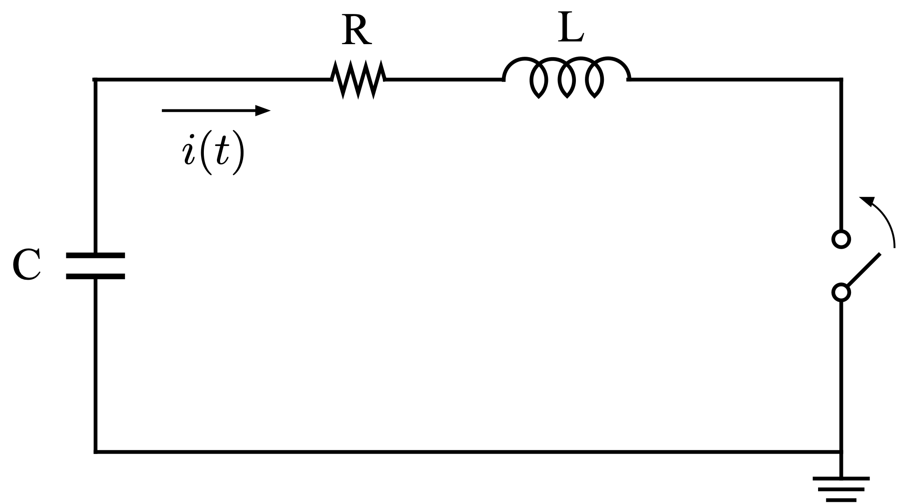

# LCR回路

過減衰の条件において、初期のコンデンサ電圧 $ V_0 $ を考慮した場合の電流 $ i(t) $ の求め方について説明します。

### 1. 微分方程式
まず、回路に適用される微分方程式は以下のようになります。

$$
L \frac{d^2i(t)}{dt^2} + R \frac{di(t)}{dt} + \frac{1}{C} i(t) = 0
$$
これは2次の線形非同次微分方程式です。

### 2. 過減衰条件
過減衰の場合の条件は、減衰係数 $\alpha$ が自然共振角周波数 $\omega_0 $ より大きい場合です。すなわち：
$$
\alpha = \frac{R}{2L}, \quad \omega_0 = \frac{1}{\sqrt{LC}}
$$
過減衰は次の条件が成り立つときです：
$$
\alpha > \omega_0 \quad \left( \frac{R}{2L} > \frac{1}{\sqrt{LC}} \right)
$$

### 3. 一般解の形
過減衰の解は次の形になります：
$$
i(t) = A e^{\lambda_1 t} + B e^{\lambda_2 t}
$$
ここで $\lambda_1 $ と $\lambda_2$は次のように定義されます：
$$
\lambda_1 = -\frac{R}{2L} + \sqrt{\left(\frac{R}{2L}\right)^2 - \frac{1}{LC}}, \quad \lambda_2 = -\frac{R}{2L} - \sqrt{\left(\frac{R}{2L}\right)^2 - \frac{1}{LC}}
$$
この解は過減衰のため、振動しない指数関数的減衰を示します。

### 4. 初期条件の設定
初期条件として、コンデンサの電圧 $V_C(0) = V_0 $、インダクタの電流 $ i(0) = 0 $、およびインダクタの初期電流の微分 $ \frac{di(0)}{dt} $も考慮します。

- コンデンサの初期電圧 $ V_0 $ は次の関係を持ちます：
$$
  V_0 = L \frac{di(0)}{dt} + R i(0)
$$
  この条件から初期電流の微分が求められます。
  
1. 初期条件 $i(0) = 0 $ から、式に代入して $ A $ と $ B $ の関係式を求めます。
2. 次に $ \frac{di(0)}{dt} = \frac{V_0}{L} $ の条件から $ A $ と $ B $ を確定します。

### 5. 最終的な解
これらの初期条件を使って $ A $ と $ B $ を決定し、最終的な電流 $ i(t) $ の解は次のようになります：
$$
i(t) = \left( \frac{V_0}{L(\lambda_1 - \lambda_2)} \right) \left( e^{\lambda_1 t} - e^{\lambda_2 t} \right)
$$
この式が過減衰条件下での抵抗 $ R $ に流れる電流です。

この解は、時間が経過するにつれて指数関数的に減衰します。 $\lambda_1 $ と $ \lambda_2 $ の符号が負であるため、電流は時間とともに減少します。